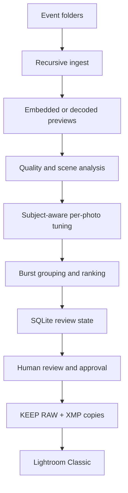

# Architecture

## Data flow

## Components

| Module | Responsibility |
| --- | --- |
| `preview.py` | Fingerprints originals; tries rawpy embedded preview, LibRaw rendering, ExifTool tags, then macOS ImageIO; caches useful-size JPEG previews. |
| `metadata.py` | Uses ExifTool, source Pillow EXIF, and embedded-preview EXIF for camera, lens, exposure, time, and dimensions. RAF/NEF extension inference remains available after failures. |
| `quality.py` | Local sharpness, luminance distribution, subject/face brightness, backlight, clipping, face/eye/smile, camera-attention, composition, and perceptual-quality signals. |
| `scenes.py` | Explainable lighting-condition classification. |
| `edits.py` | Independent subject-aware ACR tone/detail/noise recommendations and approximate preview rendering. |
| `pipeline.py` | Recursive scan, incremental processing, burst/duplicate grouping, technical tie-breaking, one-best-frame selection, and report exports. |
| `database.py` | SQLite source of truth for resumability and permanent manual overrides. |
| `workflow.py` | Approval digest, XMP gating, and safe KEEP RAW + generated-XMP Lightroom export. |
| `xmp.py` | Adobe namespace XML construction, validation, backup, and atomic sidecar replacement. |
| `streamlit_app.py` / `app.py` | Repository launcher and packaged Streamlit event summary, grid, burst review, before/after, and finish workflow. |
| `cli.py` | Headless analysis, review launch, summary, approval, XMP, and copy commands. |

## Safety boundaries

- The ingest pipeline only opens source images for reading.
- All caches, reports, and the database live under `_photo_ai/`.
- No code path deletes or moves source files.
- An approval file contains a digest of current decisions, source fingerprints, and edit values.
- Any later decision or edit causes the digest to differ, blocking XMP writing.
- Existing XMP is copied before a temporary new sidecar is atomically renamed into place.
- Export uses `copy2`, preserves the source tree, and never moves files.
- The recommended export creates XMP in a separate sibling destination and does not require sidecars beside originals.
- Overlapping source/destination trees, changed sources, duplicate KEEP pairs,
  and conflicting destination RAW files are rejected before copying begins.
- The export contains RAW files only. JPEG/TIFF KEEP records are reported but
  excluded from the Lightroom RAW folder.
- `event-photo-prep-export.json` records every exported RAW/XMP pair, source
  fingerprint, score, scene, and edit explanation.

## Failure stages

Preview decoding and image analysis are separate failure stages. Metadata from
the embedded preview is committed before quality analysis. A quality-library
failure therefore cannot mislabel an RAF as camera `OTHER`, and an error record
keeps `PROCESSING ERROR` instead of being reranked as low quality. Failed records
are retried on the next analysis and cannot be exported.

## Extension points

Quality, scene, and edit logic are independent functions so ONNX/Core ML models can replace individual measurements without changing the database or UI. `PhotoRecord.edit` is a flexible ACR parameter dictionary. A future Personal Editing Profile can implement the same `recommend_edits` interface and use camera/lens/scene features plus prior XMP targets.

People-aware selection does not identify individuals. Within each visually similar set it estimates the expected face count from the best-detected frame, then compares face completeness, eye visibility, smile evidence, camera attention, and face detail. This group-relative score prevents an unrelated large group from unfairly lowering a portrait's score.
